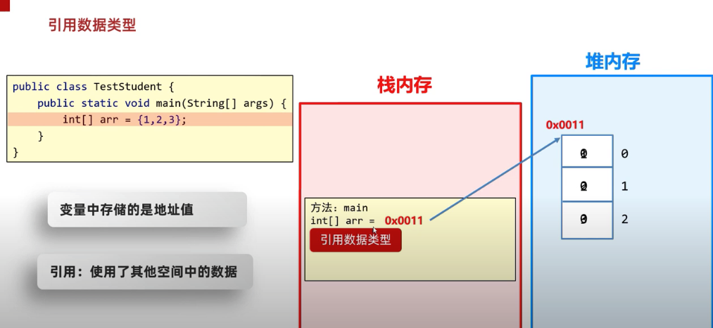
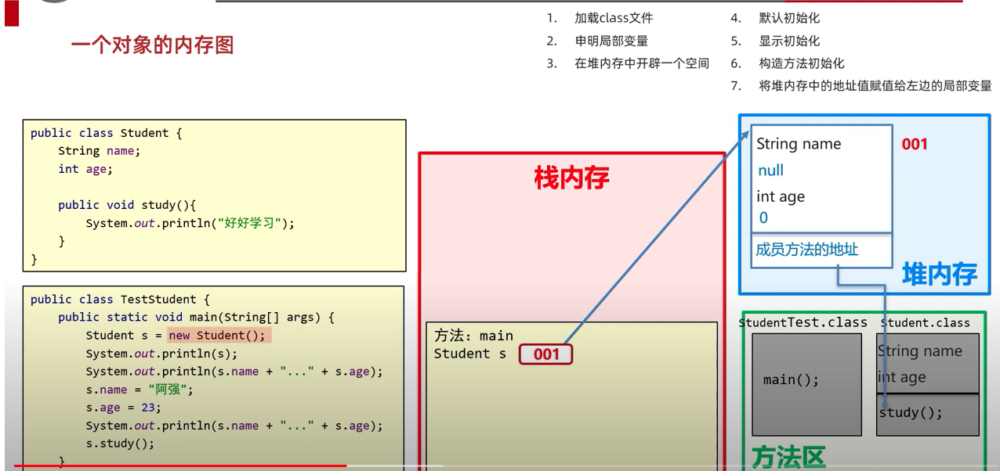
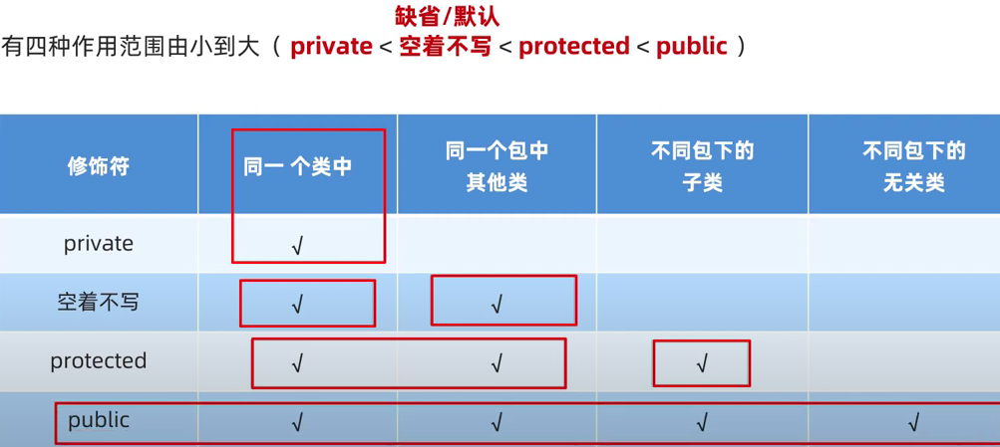
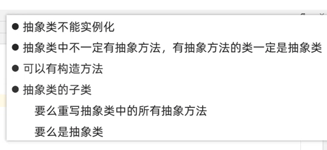
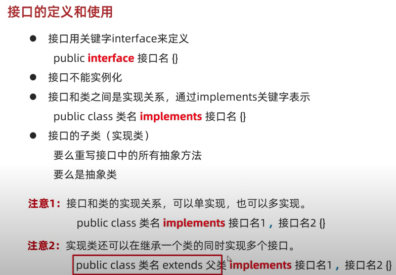
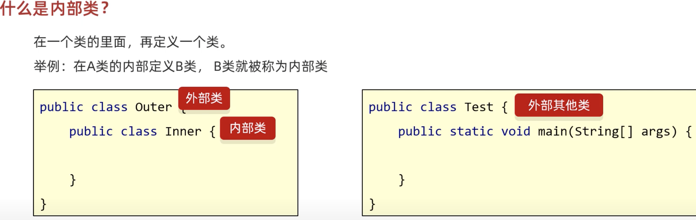

# myJavaNotes
Camille Java Notes


#### Java directory
 project/module/package/class


#### Java Primitive Types
| Type        | Description | size               |
|-------------|-------------|--------------------|
| Integer（整数） | byte        | 1 byte             |
|             | short       | 2 byte             |
|             | int         | 4 byte 2^4 = 32 位  |
|             | long        | 8 byte 2^8 = 256 位 |
| Float（小数）   | float       | 4 byte 2^4 = 32 位  |
|             | double      | 8 byte 2^8 = 256 位 |
| 字节          | char        | 2 byte             |
| 真假          | boolean     | 1 byte             |

其他所有都是 =》 引用数据类型，e.g array， string
引用数据类型存储是地址值。


类型转换 vs 强制转换
小的可以转大的， 大的不能轻易转小的。 强制转换需要casting

#### Java operators
increment ++
decrement --
- 如在variable前面（++a）， 先运算再assign
- 如在variable后面（a++）， 先assign再运算。
```agsl
int a = 10;
int b = a++;
// print a is 11, b is 10;
```

java operator precedence: https://introcs.cs.princeton.edu/java/11precedence/

java keywords: those are 51 reserved words. 

#### Java Methods
Method overloading: same method name, different parameters that Java will decide which method to run. we can change 
the parameters to make the method unique, not by changing the return type,
 
### OOP (Object Oriented Programming) 面向对象
- class： recipe, class creation (javabean)
- object: 
- instance: new XXX() 


the classic JavaBean Class need the following
- params need use private
- needs constructor includes 无参数构造（default by JVM） 和 带全部参数的构造
- getter and setter


OOP Storage in RAM:



### Array vs ArrayList
Regular Array: 
```agsl
int[] arr = new int[3];
固定的长度3， 固定的type int， 可以存储primitive type 和 引用类型
```
ArrayList
```agsl
ArrayList<String> list = new ArrayList<>(); 
没有固定长度， 可以加可以删， 只能存引用类型。 如果要存primitive type 需要。。
list.add("some");
list.add("other");
list.remove(1);

```

### Static

static in class params `private static String teacherName = "Sam";`
can be shared by all class instances.
可以直接被class 叫

权限修饰符



### Final
- final method: 最终方法， 不能被override
- final class: 最终class， 不能再有child class， 不能被inherit
- final param: 常量， 只能被assign一次


### Polymorphism
Parent p = new Child();
- 2 个class 有继承关系
- parent class 指向 child class

### abstract class
make the parent method an abstract method. 
```agsl
public abstract class Person{
    
    public abstract void work();
    
    public abstract boolean isOff(String day);
    
}
```



### oop-Interface
define some rules. 规则定义。


- Interface parameter must be `public static final` (by default)
- Interface doesn't have constructors
- all interface methods
  - `abstract method` must be override in child class when implements.
  - 或者 `default mothod`可以override，也可以不用override， 不强制。
  - or `static method` cannot be override. Can be user directly by Interface.method();
  - 或者 `private method` can only be used inside of interface class. 

inner class??


